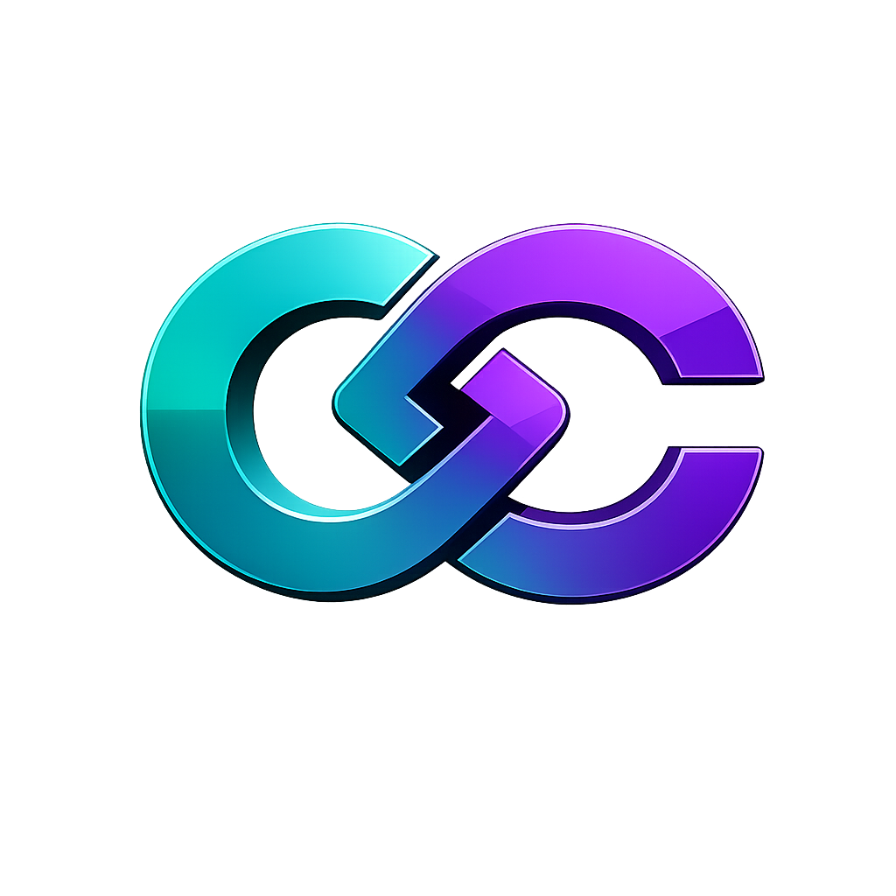
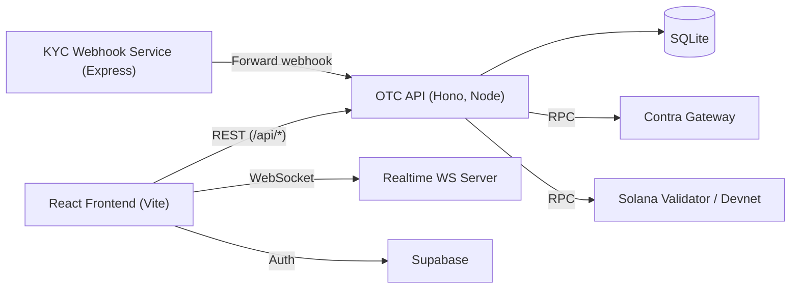

  

# Contra Clear OTC

Private, role-based OTC RFQ infrastructure on Solana + Contra.

This project was built for hackathon demonstration and focuses on a full OTC workflow:
RFQ creation, bilateral quote negotiation, escrow funding flow, compliance-oriented onboarding, and operator monitoring.

## For DoraHacks Judges

- Live demo: [Live DevNet Site to test](https://contraclear.fairway.global/)
- Video demo: [Live Demo Video](https://www.veed.io/view/1322ccfe-b88c-4911-9748-2b7a8d396e7c?source=Dashboard&panel=share)
- Technical setup guide: [`docs/SETUP_GUIDE.md`](./docs/SETUP_GUIDE.md)

Fast evaluation path:
1. Watch the video demo.
2. Walk through the live app flow (originator, provider, admin).
3. Use the setup guide only if you want to run the stack locally.

## What We Built

- Institutional OTC workspace with role separation:
  - `RFQ_ORIGINATOR`
  - `LIQUIDITY_PROVIDER`
  - `ADMIN`
- Private RFQ lifecycle:
  - Create RFQ -> submit quote -> counter -> accept/reject
- Bilateral escrow workflow:
  - Both sides submit escrow references and move through settlement states
- Wallet funding rails:
  - Deposit and withdrawal transaction builders
- KYC + DID + attestation pipeline:
  - Zyphe verification webhook -> DID record -> SAS attestation (when configured)
- Admin console:
  - RFQ activity, users, escrow state, and settlement queue views
- Real-time feed:
  - WebSocket broadcasts for RFQ/quote/escrow/deposit events

## Personas And Roles

### 1) RFQ Creator

- Connects wallet
- Proves verified participant status
- Creates RFQs and negotiates quotes
- Accepts terms and submits escrow funding reference
- Receives settlement asset when flow completes

### 2) Quote Provider

- Connects wallet
- Proves verified participant status
- Views eligible RFQs
- Submits and negotiates quotes
- If selected, submits escrow funding reference
- Receives settlement asset when flow completes

### 3) Admin / Desk Host

- Manages users, RFQs, escrow, settlements, and activity views
- Operates desk-level workflow controls
- Oversees participant access and operational state

### 4) KYC/KYB Provider

- Verifies individuals/institutions (Zyphe integration path)
- Produces verification outcome consumed by OTC backend
- Supports onboarding eligibility decisions

### 5) Compliance / Verification Layer

- Validates KYC/KYB status and role-based access
- Supports jurisdiction/tier-aware eligibility patterns
- Enforces access gating across OTC routes

### 6) Contra / Solana Execution Layer

- Supports deposit and withdrawal transaction flow
- Supports escrow-related transaction submission flow
- Provides RPC-backed state used by OTC services

### 7) Compliance / Operations Team

- Monitors RFQ lifecycle, escrow states, settlement progress, and audit events
- Uses admin views for workflow oversight and reporting

## End-To-End Flow

1. Participant onboarding
   - User completes KYC/KYB, receives verified status, and becomes eligible for OTC access.
2. RFQ creation
   - RFQ creator connects wallet, passes access checks, and publishes RFQ terms.
3. Quote response
   - Eligible quote providers submit quotes and negotiate in-platform.
4. Quote acceptance
   - RFQ creator accepts one quote and locks commercial terms.
5. Full escrow
   - Both parties submit escrow funding transactions/references.
6. Compliance and readiness checks
   - Eligibility, funding, and workflow readiness checks are enforced before final settlement state transition.
7. Settlement
   - Assets move to counterparties according to accepted terms and escrow state.
8. Completion and records
   - Trade is finalized with activity trail for operations and compliance monitoring.

## Architecture

## Hackathon Scope Notes

This repository mixes production-style flows with prototype shortcuts. Current behavior:

- Deposits and withdrawals are real transaction flows against Solana/Contra RPC endpoints.
- OTC quote and settlement orchestration is tracked in application state (SQLite).
- In the RFQ route, accepted trades are marked desk-settled (`otc-desk-settled`) for demo speed.
- Some “full on-chain” workflow expectations (for example, RFQ/quote storage and fully atomic settlement orchestration) are represented in the app-layer prototype model in this repo.
- Full infra bootstrapping for local Contra includes external dependencies and assets not committed here (see setup guide).

## Repository Layout

- `otc-frontend/` - React + TypeScript UI for traders and admins
- `otc-server/` - Hono API, RFQ logic, escrow workflow, local DB
- `webhook/` - Zyphe webhook receiver and forwarder service
- `scripts/setup-demo.sh` - Local token/keypair bootstrap helper
- `RUN.txt` - Full low-level runbook used during development

## Tech Stack

- Frontend: React 19, TypeScript, Vite, Tailwind, Solana Wallet Adapter
- API: Hono, Node.js, TypeScript
- Storage: SQLite (`better-sqlite3`)
- Chains/RPC: Solana Web3, Contra gateway
- Auth: Supabase
- Compliance/KYC integrations: Zyphe + SAS libraries
- Realtime: `ws`

## Run Locally

For a clean and complete local setup (including optional KYC path), follow:

- [`docs/SETUP_GUIDE.md`](./docs/SETUP_GUIDE.md)

## Status

Hackathon prototype in active development. If you are evaluating this project, prefer the live demo and video first, then use the setup guide for reproducibility.
